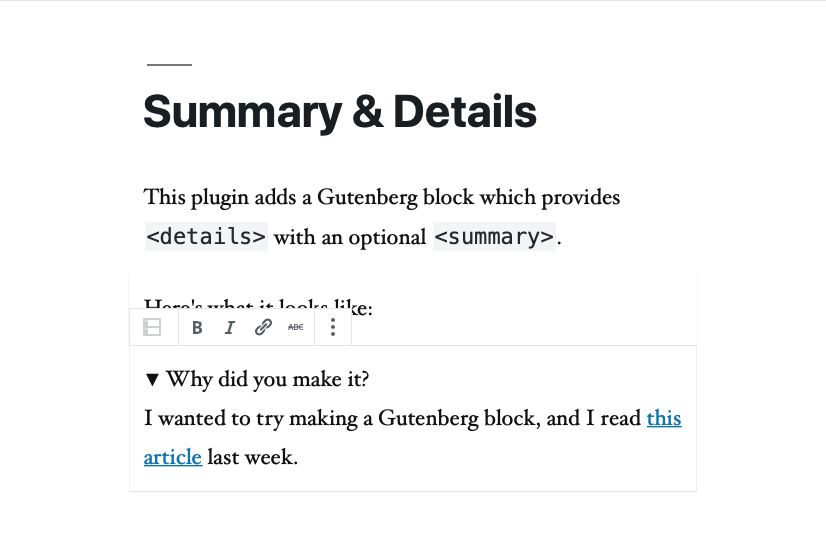

# Summary & Details

This plugin adds a Gutenberg block which provides `
` with an optional `
`.

What does that look like?

Why, just like this!

Why did you make it?

I wanted to try making a Gutenberg block, and I read <a href="https://css-tricks.com/quick-reminder-that-details-summary-is-the-easiest-way-ever-to-make-an-accordion/">this article</a> last week.

## Meta

***

_This project was bootstrapped with [Create Guten Block](https://github.com/ahmadawais/create-guten-block)._
